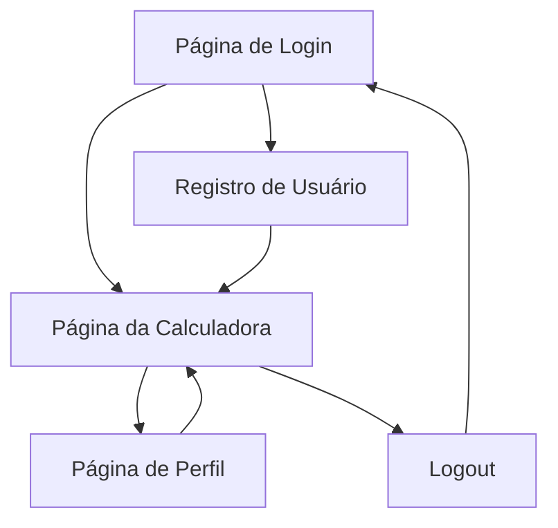

# Calculadora Kogui - Documento de Requisitos do Produto

## 1. Product Overview

Uma aplicação web de calculadora que permite aos usuários realizar operações matemáticas básicas (soma, subtração, multiplicação e divisão) com sistema de autenticação, histórico de operações e interface moderna já desenvolvida.

O sistema resolve a necessidade de ter uma calculadora web personalizada com controle de usuários e histórico de cálculos, permitindo que cada usuário mantenha seu próprio registro de operações realizadas.

## 2. Core Features

### 2.1 User Roles

| Role | Registration Method | Core Permissions |
|------|---------------------|------------------|
| Usuário Padrão | Registro por email e senha | Pode realizar cálculos, visualizar histórico próprio, gerenciar perfil |

### 2.2 Feature Module

Nossos requisitos da calculadora consistem nas seguintes páginas principais:

1. **Página de Login**: formulário de autenticação, registro de novos usuários
2. **Página da Calculadora**: interface de cálculo, display de resultados, histórico lateral
3. **Página de Perfil**: informações do usuário, histórico completo paginado, estatísticas

### 2.3 Page Details

| Page Name | Module Name | Feature description |
|-----------|-------------|---------------------|
| Página de Login | Formulário de Login | Autenticar usuário com email e senha, validação de campos |
| Página de Login | Formulário de Registro | Criar nova conta com nome, email e senha, validação de dados |
| Página da Calculadora | Interface de Cálculo | Botões numéricos e operadores, display de entrada e resultado |
| Página da Calculadora | Processamento de Operações | Calcular expressões matemáticas, validar entrada, tratar erros |
| Página da Calculadora | Histórico Lateral | Exibir últimas operações realizadas, limpar histórico |
| Página de Perfil | Informações do Usuário | Exibir e editar dados pessoais (nome, email) |
| Página de Perfil | Histórico Completo | Listar todas operações com paginação, estatísticas de uso |
| Sistema Backend | Autenticação JWT | Gerar e validar tokens de acesso, refresh tokens |
| Sistema Backend | Modelo de Usuário | Gerenciar dados de usuários no banco SQLite |
| Sistema Backend | Modelo de Operação | Armazenar operações matemáticas com timestamp |
| Sistema Backend | API REST | Endpoints para login, registro, cálculos e histórico |

## 3. Core Process

**Fluxo Principal do Usuário:**
1. Usuário acessa a página inicial (login)
2. Faz login ou cria nova conta
3. É redirecionado para a calculadora principal
4. Realiza operações matemáticas
5. Visualiza histórico em tempo real
6. Pode acessar perfil para ver histórico completo
7. Pode fazer logout

## 4. User Interface Design

### 4.1 Design Style

- **Cores primárias**: Gradiente azul escuro (#1a1a2e, #16213e, #0f3460)
- **Cores secundárias**: Roxo (#8338ec), azul (#3a86ff), rosa (#ff006e)
- **Estilo de botões**: Arredondados com efeito glassmorphism
- **Fonte**: System fonts (-apple-system, BlinkMacSystemFont, 'Segoe UI')
- **Layout**: Design moderno com backdrop-filter blur, cards flutuantes
- **Ícones**: Emojis para ações (🧮, 📊, 🚪, etc.)

### 4.2 Page Design Overview

| Page Name | Module Name | UI Elements |
|-----------|-------------|-------------|
| Página de Login | Container Principal | Fundo gradiente, card central com glassmorphism, logo Kogui |
| Página de Login | Formulários | Inputs com fundo translúcido, botões com gradiente, transições suaves |
| Página da Calculadora | Header | Logo, nome do usuário, botões de navegação com backdrop-filter |
| Página da Calculadora | Calculadora | Grid 4x4 de botões, display preto, botões coloridos por função |
| Página da Calculadora | Histórico | Card lateral com scroll, itens com borda esquerda roxa |
| Página de Perfil | Grid Layout | Duas colunas: perfil à esquerda, histórico à direita |
| Página de Perfil | Avatar | Círculo com gradiente, inicial do nome, informações editáveis |

### 4.3 Responsiveness

O produto é desktop-first com adaptação mobile responsiva. Em telas menores que 768px, o layout muda para coluna única e elementos se reorganizam verticalmente. Touch interactions são otimizadas para dispositivos móveis.